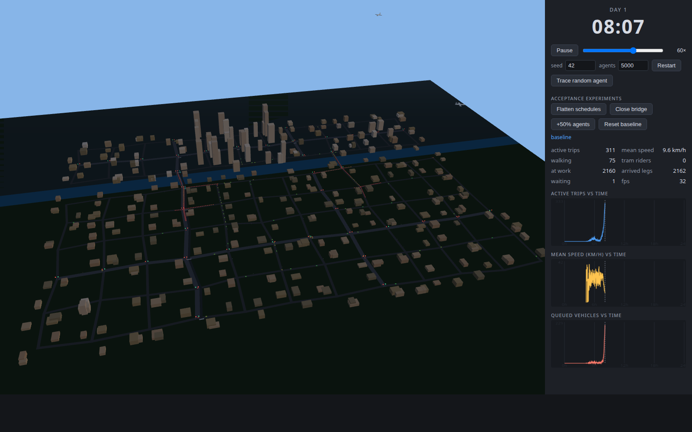
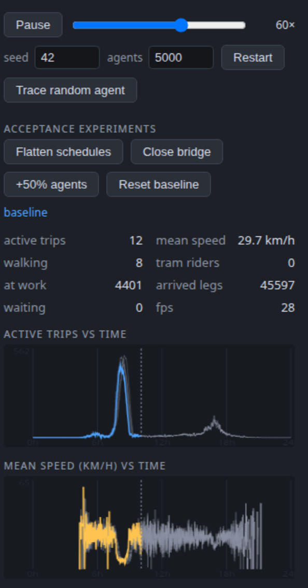
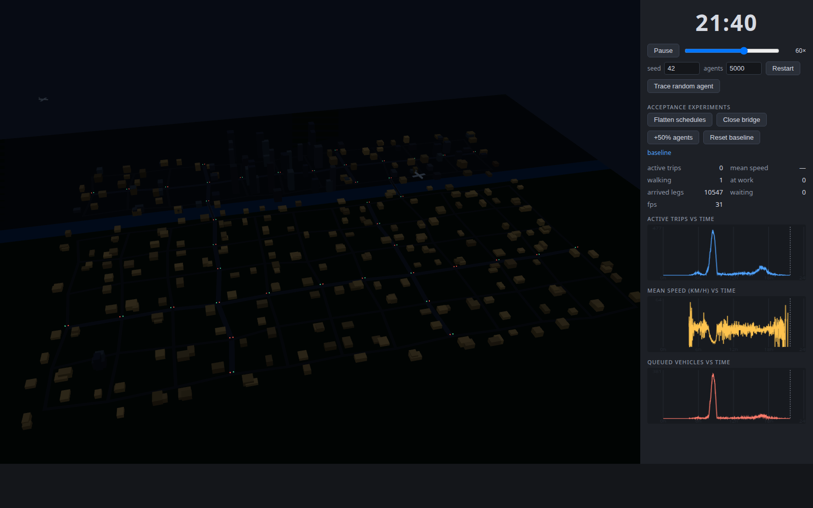

# SimS — Emergent City Sandbox

A real-time, agent-based 3D city that runs day after day. Thousands of
individual people plan their own day ("be at work by 08:23, ~8.5 h, maybe a
lunch errand, then home"), drive, walk or ride the tram toward the jobs
across the river — and the city's rhythm **emerges**: a morning rush hour, a
softer evening peak, businesses lighting up as their workers physically
arrive, residential windows glowing after dark, platform crowds swelling
before 8 am, planes drifting overhead.

And then the city **learns**. Every night each agent reconciles what they
experienced with what they expected; over successive days the morning peak
visibly migrates earlier and commuters burned by the bridge queue shift onto
the tram — the documented real-world phenomena, reproduced purely from
individual memory.


*Day 1, ~08:30 — red chains of queued cars spill back from the two bridges;
a teal tram crosses its own track beside the arterial bridge; CBD towers
north of the river.*


*Day 5 — faded ghosts of days 1–4 under today's bright line: the morning
peak has migrated earlier and tightened, purely from nightly self-revision.*


*21:36 — offices have gone dark (their workers left), homes glow warm
(their residents actually made it back). Nothing reads opening hours — light
follows people.*

## Run

```sh
pnpm install
pnpm dev          # 3D sandbox (Vite + three.js); orbit/zoom with the mouse
pnpm headless     # full seeded day in Node: timeline + calibration stats
pnpm headless --days 10   # multi-day learning run with the per-day proof table
pnpm headless --check     # determinism proof (two runs, hash compare)
pnpm lint         # Biome
```

URL params: `?seed=7` (new world), `?n=3000` (population), `?warp=8.25`
(fast-forward to 08:15 — hours may span days: `?warp=104.9` boots straight
into day 5 of the learned city), `?close=7.75` (auto-close the arterial
bridge). UI: play/pause, 1–600× speed, seed/agents restart, **Trace random
agent** (route line + beacon + live plan status — including "waiting on the
platform"), and the acceptance experiment buttons (below).

## The One Rule

**Nothing about traffic is a function of the time of day.** There is no
`if (hour === 17) makeTraffic()` anywhere. The clock shapes behaviour in
exactly one place: each agent's sampled daily plan (`sim/population.ts`,
distributions in `config.ts`). Compliant fixtures that read the clock without
encoding demand: signal cycles and the tram timetable (identical, periodic,
all 24 h — trams run empty at 3 am), the sun and ambient planes
(astronomy/decor), and metric timestamps. Day-to-day learning reads no clock
either — only each agent's own experienced vs expected commute. Audited:
`sim/` contains no `Math.random`, no `Date.now`, no `Math.pow`, and no
time-of-day constants outside the plan distributions.

## How the day emerges

1. **Plans** (the only clock-coupled code): ~80% drive, ~12% prefer walking
   (and do, if home–work ≤ 1.7 km), ~8% work from home. Work starts cluster
   around 08:15; 15% of drivers plan a midday errand; everyone returns after
   their personal work duration. Trips CHAIN off real arrivals — a commute
   that congestion made 40 min late pushes that person's whole day.
2. **Geography**: homes mostly south of the river, jobs mostly north; only
   two one-lane bridges cross. ~38 veh/min aim at bridges that discharge
   ~23 veh/min through their signals → the morning queue MUST form.
3. **Microscopic physics** (`sim/traffic/idm.ts`): every vehicle runs the
   Intelligent Driver Model; queues, stop-and-go waves and **spillback**
   (full edges refuse entry, jams grow backwards) follow from gap dynamics.
4. **Reaction, not scripting** (`sim/routing.ts`): every edge keeps an EMA of
   travel times real vehicles just measured; drivers route on those observed
   costs at departure, stuck vehicles re-plan (≤3×). Jams repel newcomers —
   congestion spreads across parallels and dissolves from the edges. This
   negative feedback cut p90 delay from 32 min (Phase 1 static routes) to
   ~7 min at identical demand.
5. **The visible city follows the people**: a business "opens" (brightens)
   the moment its node's `workersAt` goes positive; home windows at night
   scale with `residentsAt`. Both counters are maintained purely by actual
   arrivals/departures.

## Acceptance experiments — proving it's emergent (buttons in the UI)

| experiment | result (seed 42, N = 5000) | proves |
|---|---|---|
| baseline | am peak 442 active, min 4.6 km/h; pm peak 94, min 16 km/h | the two peaks exist |
| **Flatten schedules** (`--flatten`) | peaks collapse to ~33; never below 18 km/h | peaks come from schedule overlap, not any time-based code |
| **Close bridge** at 07:45 (`--close`) | arterial-bridge flow → 0; local bridge jumps to its 15 /min ceiling; 1059 active at 0.9 km/h; p90 64 min | congestion re-routes spatially and intensifies on parallels |
| **+50% agents** (`--boost 1.5`) | am peak 1386, pm 578; evening also collapses (3.5 km/h) | congestion is coupled to road capacity, nonlinearly |

Demand→capacity coupling (baseline morning): N=2000 → bridges underloaded,
p90 2.9 min; N=3000 → at capacity, brief saturation; N=5000 → v/c > 1,
collapse. 2.5× the population, ~19× the p90 delay.

## Day-to-day learning (Phase 3) — the city teaches itself

Nightly, ~45% of agents revise: `expectedCommute ← EMA(experienced)`, the
lateness buffer grows asymmetrically (being late hurts more than being
early), and commuters near the tram line pick tomorrow's mode from their own
two learned expectations (× a personal comfort affinity). Measured over 10
days (seed 42, `pnpm headless --days 10`):

| day | am peak | min speed | mean depart | mean late | p90 delay | tram share |
|----:|--------:|----------:|------------:|----------:|----------:|-----------:|
| 1 | 520 @ 08:30 | 3.6 km/h | 07:54 | 3.2 min | 14.6 min | 0.0 % |
| 4 | 511 @ 08:14 | 4.0 km/h | 07:51 | 2.1 min | 14.6 min | 3.6 % |
| 7 | 461 @ 08:08 | 4.4 km/h | 07:49 | 0.9 min | 14.2 min | 6.5 % |
| 10 | 383 @ 08:00 | 5.9 km/h | 07:48 | 0.3 min | 11.8 min | 7.4 % |

The peak migrates **30 minutes earlier and shrinks 26%**, lateness collapses
toward zero, and the tram's mode share grows monotonically from nothing —
two relief valves (when to leave, what to ride) opened by nothing but
individual experience. The ghost charts in the UI show it live.

## Module map

```
src/config.ts               every tunable; the only time-of-day numbers are
                            the plan distributions
src/sim/rng.ts              mulberry32 + named sub-streams; full determinism
src/sim/network.ts          procedural city: grid, river, 2 bridges, CBD/hubs
src/sim/population.ts       agents & daily plans (THE only clock-coupled code)
src/sim/routing.ts          Router: per-edge EMA of observed times + Dijkstra;
                            per-agent taste noise (anti-herding)
src/sim/traffic/idm.ts      IDM + ballistic integrator (stop-within-step)
src/sim/traffic/junction.ts periodic signal phase evaluation
src/sim/traffic/engine.ts   SoA vehicle pool, lane FIFOs, spillback as leader
                            selection, amber-commit, FCFS priority, closures,
                            stuck re-planning, edge-traversal observations
src/sim/walkers.ts          sidewalk pedestrians (plans without road load)
src/sim/transit.ts          tram line: closed-form periodic timetable +
                            rider state machine (walk → wait → ride → walk)
src/sim/learning.ts         nightly self-revision: expectations, buffers,
                            mode choice — from each agent's OWN experience
src/sim/scheduler.ts        event-heap multi-day choreography: trip chains +
                            building occupancy (workersAt / residentsAt)
src/sim/metrics.ts          per-minute series; per-kind trip delays
src/sim/sim.ts              framework-agnostic façade (probes, closures,
                            midnight rollover, hash)
src/render3d/               three.js sandbox: city, buildings (occupancy
                            lighting), instanced cars/pedestrians, tram +
                            platform crowds, signals, planes, day/night sky
src/render/charts.ts        dependency-free 24h charts with multi-day ghosts
scripts/headless.ts         Node runner: calibration, probes, experiments,
                            --days learning table, determinism hashes
```

## Determinism

Same seed ⇒ identical day, bit-for-bit: all randomness flows through named
mulberry32 streams, iteration orders are fixed, the event heap breaks ties by
sequence number, and `pnpm headless --check` compares FNV-1a hashes over the
full dynamic state of two runs. UI-side randomness (which agent to trace)
deliberately uses `Math.random` — it must not touch sim streams.

## Status & roadmap

- **Phase 1 (done)**: morning-commute MVP, calibrated bridges, 2D view.
- **Phase 2 (done)**: full day (returns + errands + evening peak),
  congestion-aware re-routing, walkers, acceptance experiments, and the 3D
  sandbox (buildings, occupancy lighting, day/night, planes).
- **Phase 3 (done)**: multi-day simulation with day-to-day learning (peak
  spreading) and a tram line with emergent mode choice. The spec's optional
  OSM import was deliberately left out — the procedurally calibrated city is
  this project's controlled experiment; swapping in a real map is a natural
  future extension of `sim/network.ts` alone.

## Assumptions & known simplifications

- The river + two one-lane bridges are the deliberate structural bottleneck;
  default N = 5000 (an open grid would need ~12–16k agents to jam).
- Lanes are independent FIFOs chosen at entry; no mid-edge lane changes, no
  protected left turns; junctions are zero-length with a 7 m/s corner cap.
- Signals only at arterial junctions and bridgeheads; local×local crossings
  use deterministic first-come-first-served priority.
- Errands are driver-only (tram days skip the shop run); walkers and riders
  ignore road closures (sidewalks and the tram's right-of-way stay open).
- The tram has unlimited capacity and never interacts with car traffic (own
  right-of-way); riders board the next scheduled departure — platform
  crowding is visual, not a constraint (a future squeeze point if desired).
- Learning uses the morning leg only; errand timing and work targets are
  fixed traits. Mode choice exists where both walk legs are ≤ 600 m of a stop.
- Night driving averages ≈ 0.5× free-flow — the cost of signals on an empty
  network (infrastructure baseline), not congestion.
- Building lights are render-side reads of occupancy counters; planes are
  periodic decoration; arrival releases road capacity instantly.
