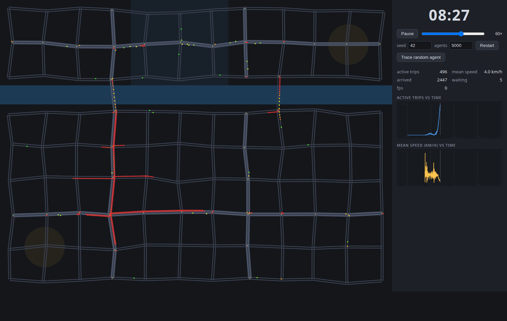
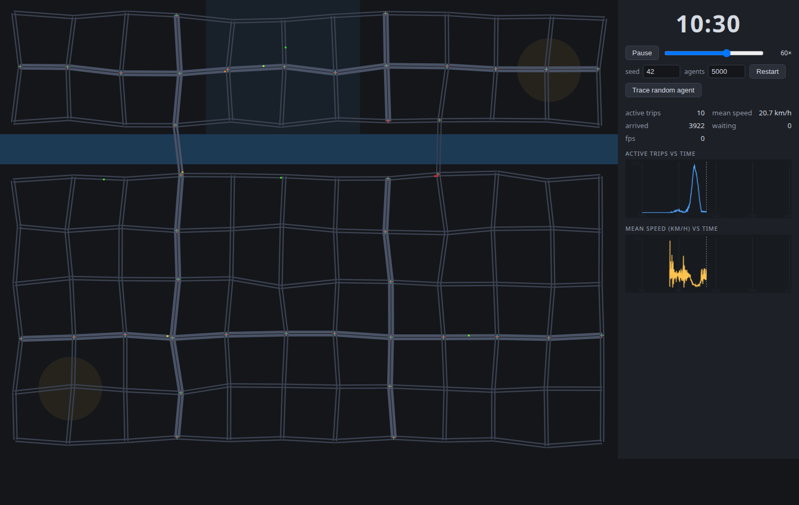

# SimS — Emergent City Traffic

A real-time, agent-based simulation of a city's daily mobility. Thousands of
individual people plan their own day ("I want to be at work by 08:23"), drive
from home toward the jobs across the river — and a rush hour **emerges**,
purely from their plans overlapping on a network with finite capacity.


*08:27 — 496 vehicles en route, network mean 4 km/h. Queues (red) spill back
from the two bridges through the southern arterials.*


*10:30 — the same network, nothing changed except time passing: the queue has
discharged, 20.7 km/h, roads empty. The active-trips chart shows the full
asymmetric peak (fast rise, slow hysteretic drain).*

## Run

```sh
pnpm install
pnpm dev          # browser app (Vite)
pnpm headless     # full seeded day in Node: timeline + calibration stats
pnpm headless --check   # run the day twice, compare state hashes (determinism)
pnpm lint         # Biome
```

URL params: `?seed=7` (new world), `?n=3000` (population), `?warp=8.25`
(fast-forward to 08:15 on load). UI: play/pause, 1–600× speed slider,
seed/agents restart, **Trace random agent** (highlights one person's route,
plan and live status).

## The One Rule

**Nothing about traffic is a function of the time of day.** There is no
`if (hour === 17) makeTraffic()` anywhere. The clock is allowed to influence
behaviour in exactly one place: each agent's personal daily plan
(`sim/population.ts`), sampled from configurable mixture distributions
(`config.ts → population.startMix`). Two compliant fixtures also read the
clock without encoding it: traffic signals run the identical periodic cycle
all 24 h (`sim/traffic/junction.ts`), and metrics timestamp their samples.
Verified by audit: `sim/` contains no `Math.random`, no `Date.now`, no
`Math.pow` (cross-engine rounding), and no time-of-day constants.

## How congestion emerges

1. **Plans**: ~80% of agents drive; work-start times cluster around 08:15
   (σ ≈ 25 min) with early and late tails. Each agent departs at
   `workStart − freeFlowTravelTime − personalBuffer`.
2. **Geography**: homes are mostly south of the river, jobs mostly north
   (CBD). Only two one-lane bridges cross. Around 07:45 the independent
   departures stack up to ~35–40 veh/min aimed at bridges that can discharge
   ~23 veh/min through their signals.
3. **Microscopic physics** (`sim/traffic/idm.ts`): every vehicle runs the
   Intelligent Driver Model — accelerate toward desired speed, brake to keep
   a speed-dependent safe gap. When inflow exceeds discharge, gaps shrink and
   queues form at the stop lines.
4. **Spillback** (`sim/traffic/engine.ts`): a lane head crosses a junction by
   "following" the last vehicle of its next edge; when that edge is jammed to
   its entrance the head queues at the line even on green, and the jam grows
   *backwards* through the network. At the peak this visibly halves bridge
   throughput (capacity drop) — which is why the queue drains only ~45 min
   *after* demand has already subsided.

Delete the agents and there is no traffic. Flatten their schedules and the
peak disappears. Congestion is never commanded; it is what's left over when
too many independent plans meet too little road.

### Measured demand → congestion coupling (seed 42)

| N agents | peak bridge flow | min mean speed | p90 delay | verdict |
|---------:|-----------------:|---------------:|----------:|---------|
| 2 000    | 17 /min          | 12.6 km/h      |  2.9 min  | free flow |
| 3 000    | 23 /min (≈ capacity) | 13.1 km/h  |  3.3 min  | brief saturation |
| 5 000    | 24 → 12 /min (capacity drop) | 2.1 km/h | 32.1 min | rush-hour collapse |

A 2.5× population produces a 19× p90 delay — the nonlinear signature of
queueing at a capacity constraint, impossible to fake with a clock rule.

## Acceptance experiments (Phase 2 will expose these as live buttons)

1. **Flatten schedules** — resample work starts uniformly across the day:
   the peaks in the charts must disappear (proves peaks come from schedule
   overlap, not time-based code).
2. **Close a central arterial mid-run** — congestion must re-route and
   intensify on parallel streets (proves jams respond to space, not clock).
3. **+50% agents** — peaks must intensify and broaden (proves congestion is
   coupled to road capacity). The table above already demonstrates this
   coupling headlessly.

## Module map

```
src/config.ts              every tunable number; the only time-of-day numbers
                           in the project are the plan distributions here
src/sim/rng.ts             mulberry32 + named sub-streams; seeded determinism
src/sim/network.ts         procedural city: grid, river, 2 bridges, CBD/hubs,
                           road classes, fixed-cycle signal placement
src/sim/population.ts      agents + daily plans (THE only clock-coupled code)
src/sim/routing.ts         Dijkstra on free-flow times + per-agent tie noise
                           and arterial affinity (anti-herding heterogeneity)
src/sim/traffic/idm.ts     IDM + ballistic integrator (stop-within-step)
src/sim/traffic/junction.ts periodic signal phase evaluation
src/sim/traffic/engine.ts  SoA vehicle pool, lane FIFOs, spillback as leader
                           selection, amber-commit, FCFS priority, spawning
src/sim/scheduler.ts       fixed-dt tick loop, departure dispatch
src/sim/metrics.ts         per-minute series + trip log (delay vs free flow)
src/sim/sim.ts             framework-agnostic façade (step / probes / hash)
src/render/                canvas city view + dependency-free charts
src/ui.ts, src/main.ts     DOM wiring, RAF accumulator (render ⊥ sim rate)
scripts/headless.ts        Node day-runner: calibration, probes, determinism
```

## Status & roadmap

- **Phase 1 (done)**: morning commute MVP — emergent peak forms and dissolves;
  headless + visual verification; deterministic replays.
- **Phase 2**: return commute (evening peak), congestion-aware stochastic
  re-routing, queue-length chart, the three acceptance experiments as UI.
- **Phase 3 (optional)**: day-to-day departure/route learning (peak spreading),
  OSM import, transit mode.

## Assumptions & known simplifications (Phase 1)

- The river + two one-lane bridges are the deliberate structural bottleneck;
  an open 12×9 grid would need ~12–16k agents to saturate. Default N = 5000
  (the spec's 800–2000 runs uncongested — see table; tune via `?n=`).
- Lanes are independent FIFOs chosen at edge entry; no mid-edge lane changes
  or overtaking. No protected left turns (turn conflicts inside a green phase
  are ignored). Junctions are zero-length; a 7 m/s corner cap approximates
  turn friction.
- Signals only at arterial-involved junctions and bridgeheads; local×local
  crossings use deterministic first-come-first-served priority.
- Night-time trips average ≈ 0.45–0.55× free-flow speed — that is the cost of
  signals/stops on an empty network (the infrastructure baseline), not
  congestion; congestion is measured against the ≈ 18 km/h off-peak mean.
- One day per run; arrival releases road capacity instantly; schools are
  folded into the early-shift mixture component.
